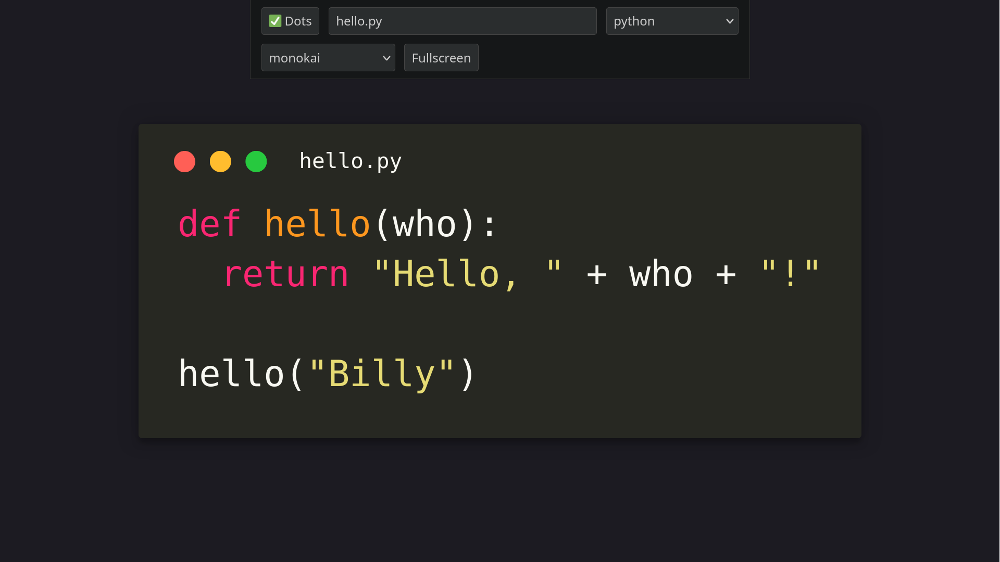

# CodeShow

Simple code presentation tool for videos, screencasts, and live demos.

Open `index.html` or [mccormick.cx/apps/codeshow](https://mccormick.cx/apps/codeshow) in your browser to use it.

## Features

- Syntax highlighting (CodeMirror)
- Adjustable color themes (CodeMirror)
- Full-screen display
- Filename display (optional)
- Window dots decoration (optional)
- Config is auto-saved to localStorage

## Usage

- Click anywhere outside the code box to toggle the config interface.
- Use the built-in browser zoom if you want bigger or smaller code.
- Take a screenshot to get an image you can re-use.
- To self-host, upload `index.html`, `style.css`, and `main.cljs` to your server.

## Technology

- [Scittle ClojureScript](https://github.com/babashka/scittle/).
- [Reagent](https://reagent-project.github.io/).
- [CodeMirror](https://codemirror.net) (v5).

## License

MIT
